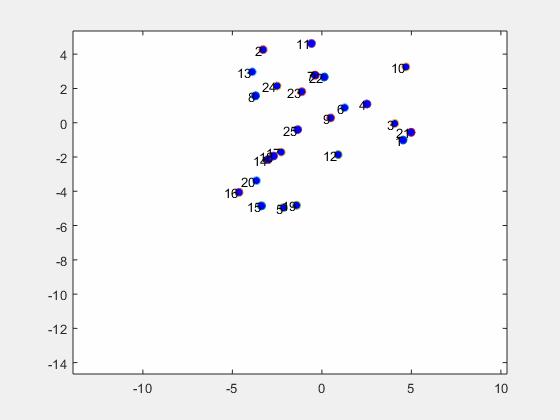
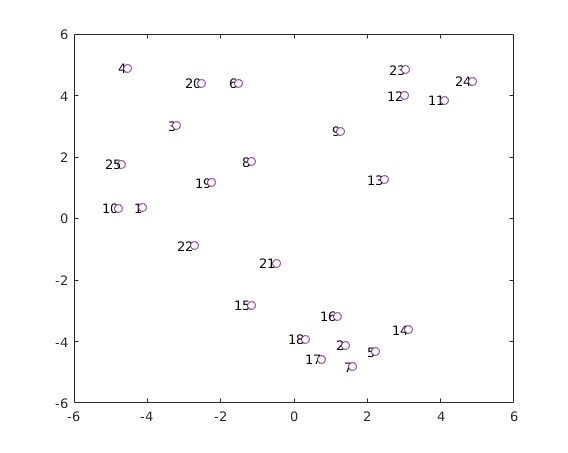
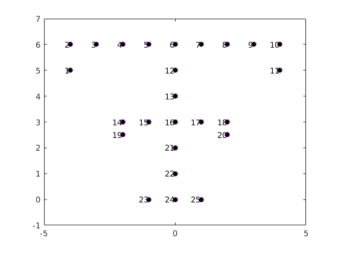
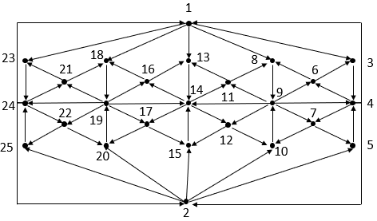
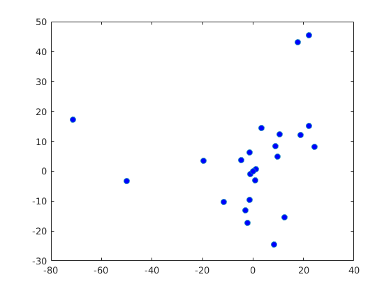
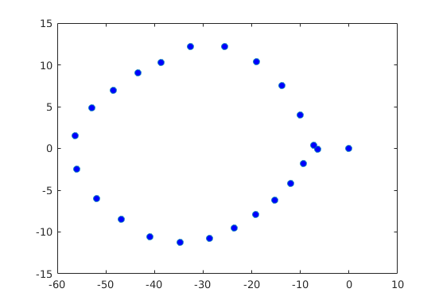
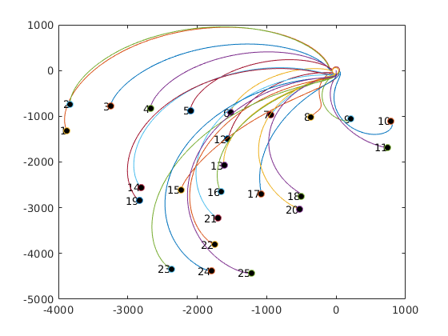

# Mobile Agent Simulator
A coordinate-free simulation of shape and formation control of mobile agents in the complex plane building upon work from [Z. Lin et al (2016)](https://ieeexplore.ieee.org/document/7153547/). All code is original and was reverse-engineered from the original papers by Zhiyun Lin et al.

 
<em>An animated example of the paths the mobile robots will take relative to each other to achieve the formation. Note the velocity decreasing towards the end.</em>

These MATLAB scripts used in tandem can help determine the path of a group of mobile robots each must take to obtain a specific formation without regard to any common coordinate system. For example, we may have the following arrangement of robots as seen here:

Perhaps we want the robots to move into a desired formation (so as to avoid some sort of obstacle in the environment). We choose the following (non-generic) arrangment:

  

Suppose that the robots are equipped with cameras to help them observe their surroundings. To create a decentralized network to obtain the desired formation shape, we create a sensing network (or sensing graph) that explains the flow of information between each of the robots in the network (in this case, the information flowing in the network for any robot is the visual sight of another robot). 

 

Here, a robot will adjust its position based on how the robots it sees are moving. The direction that sight (information) flows is that the robot on the terminal end of the directed edge is seeing the robot from which the tail is coming from. The choice of a directed graph in this case is advantageous by providing freedom that any two robots do not necessarily need to see each other as in the undirected case.

As shown in Zhiyun Lin's 2016 paper, this problem can be posed using a complex graph Laplacian approach. Using the complex plane as our global reference frame allows for some simplifications due to the rectangular form of a complex number. Unlike the real case where the eigenvalues of the dynamical system x' = -Lx are guaranteed to be distributed in the left-half complex plane (where x is the aggregate state vector of the n agents, and L is the Laplacian of the sensing graph), systems involving a complex Laplacian can have their eigenvalues distributed all throughout the complex plane:

  
   
  <em>Eigenvalue distribution of z' = -Lz</em>

Having the eigenvalues in the left-half complex plane is important for both stability of the critical points of the system and the agents settling into their position with velocity decreasing exponentially to zero. Hence, we must introduce a stabilizing matrix D. To determine the matrix D, we must solve the multiplicative inverse eigenvalue problem for some given set of n eigenvalues, where 2 eigenvalues are fixed to be zero (Lin 2016). By running this MATLAB script in the appropriate stages, we can shift all of the nonzero eigenvalues into a Gershgorin circle with respect to some convergence parameter alpha (how quickly we want our agents to stabilize their formation shape).

  
   
  <em>Eigenvalue distribution of z' = -DLz</em>

By solving the dynamical system, we can determine the agents must take the following trajectories to reach their desired formation, and likewise have their velocity slow down exponential.

  
   
  <em>The trajectories of the robots to reach the desired formation (zoomed out for clarity).</em>

In this case, the agents must move very far and very quickly to reach their desired formation (the graph has been zoomed out to demonstrate the formation shape). See the animated GIF at the top of the README for the animation from a similar example.
The MATLAB code has been generalized a fair amount to allow for any number of agents, and initial conditions for the system chosen to obtain the solution in a reasonable amount of time.

# Potential Real-World Applications

  
   
  <em>A group of Intel Drones flying in formation to create a 4th of July show in lieu of a fireworks display. Reused from the US Department of Defense under CC.</em>

A novel application that this method could be used in would be 4th of July celebrations where using fireworks is dangerous or simply not possible.
